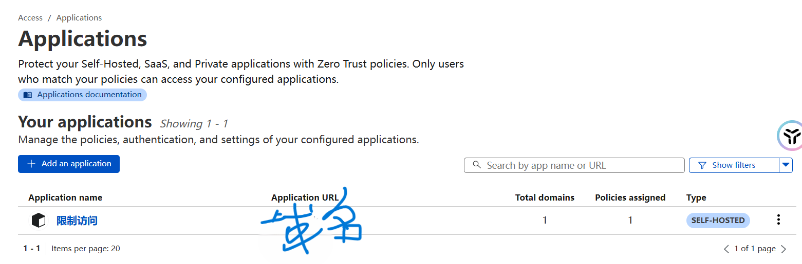

#### 1、环境准备

##### windows主机中的环境

win11专业版本、安装vmware pro 17、ubuntu24.0.4、24.04.2 LTS

主机安装clash开启allow lan

##### ubuntu中的环境

必须安装：

```
git、npm、gedit、yarn、python3-venv
python3-dev、python3-setuptools、yarn、nodejs20
docker
```

可选：

```
vscode、vmware-tools、net-tools
```

##### 在需要的时候进行代理配置：

shell

```
ip="192.168.124.3"
export http_proxy="http://"$ip":7890"
export https_proxy="http://"$ip":7890"
```

git

```
ip=192.168.124.3
git config --global http.proxy http://$ip:7890
git config --global https.proxy http://$ip:7890
```

npm

```
ip="192.168.124.3"
npm config set proxy   "http://"$ip":7890"
npm config set https-proxy "http://"$ip":7890"
```

##### 配置过程中遇到的问题：

* ubuntu与主机无法复制或拖文件：

  ```
  1.更新清华源，24版本的更新源方法与之前不同
  2.彻底删除open-vm-tools：sudo apt autoremove open-vm-tools
  3.在安装：sudo apt install open-vm-tools open-vm-tools-desktop -y
  4.在reboot
  5.还是无法解决，尝式注销后，点击用户，然后点右下角那也切换一下
  ```

* docker镜像不能用：清华等常见的镜像不可用。

  目前可用镜像：https://blog.whsir.com/post-8126.html

  指定镜像源：

  ```
  创建/etc/docker/daemon.json
  添加内容：
  {
      "registry-mirrors": [
          "https://dockerproxy.com",
          "https://docker.mirrors.ustc.edu.cn",
          "https://docker.nju.edu.cn"
      ]
  }
  重启相关服务：
  sudo systemctl daemon-reload
  sudo systemctl restart docker
  ```

* docker当前用户没有使用权限：

  ```
  # 将当前用户加入 docker 组
  sudo usermod -aG docker $USER
  # 立即让当前 shell 生效（不需重登）
  newgrp docker
  ```

* 安装脚本中安装nvm时要开启shell代理

* 20版本的ubuntu的docker安装

  ```
  sudo apt-get install -y apt-transport-https ca-certificates curl software-properties-common
  curl -fsSL https://download.docker.com/linux/ubuntu/gpg | sudo tee /etc/apt/trusted.gpg.d/docker.asc
  sudo add-apt-repository "deb [arch=amd64] https://download.docker.com/linux/ubuntu focal stable"
  sudo apt-get install docker.io
  ```

  

#### 2、ghost源码安装

> 源码安装官方文档：https://ghost.org/docs/install/source/#prerequisites

##### 配置流程

从ghost官方（https://github.com/TryGhost/Ghost#）github页面右上角点击fork到自己的github

克隆源码：git clone --recurse-submodules https://github.com/TryGhost/Ghost.git && cd Ghost

配置修改remote：

```
# Rename origin to upstream
git remote rename origin upstream
# Add your fork as an origin, editing in <YourUsername>!
git remote add origin git@github.com:<YourUsername>/Ghost.git
```

初始化设置和安装：该`setup`任务将安装依赖项、初始化数据库、设置 git hooks 并初始化子模块。

```
# Only ever run this once
# 执行前需要开启shell代理，进入到Ghost目录执行yarn setup
# 同时给Ghost目录当前用户权限：sudo chmod -R 777 Ghost
yarn setup
```

启动：默认访问http://localhost:2368/ 后台管理http://localhost:2368/ghost/

```
# 增加文件观察器上限，编辑 /etc/sysctl.conf 文件，增加或修改以下内容：
fs.inotify.max_user_watches=524288
yarn dev
```

##### 开发：

在Ghost/ghost下编辑config.devlop.json

```
1.添加这个用于配置邮箱验证
"mail": {
    "transport": "SMTP",
    "options": {
      "service": "QQ",
      "host": "smtp.qq.com",
      "port": 465,
      "secure": true,
      "auth": {
        "user": "your-email@qq.com",  // 你的 QQ 邮箱地址
        "pass": "your-auth-code"  // 你的授权码（不是密码）
      }
    }
  }
2.配置vmware中的ghost到内网可以访问
"url": "http://192.168.72.130:2368",
"server": {
    "host": "0.0.0.0",
    "port": 2368
}
  
```

* 问题：打包后，修改源码后会无法yarn setup，总是报一个包找不到

##### 配置过程中遇到的问题：

* git克隆项目时访问不了：配置git走主机的clash代理

* 第一次运行yarn setup时报错 访问不了某些资源：关闭shell代理

* yarn setup过程中报错安装不了mysql和redies的docker镜像：配置可用的源，关闭shell代理

* yarn dev启动时报错找不到相关资源：配置走代理

  ```
  启动前进行配置：
  export ALL_PROXY="socks5h://192.168.124.3:7890"
  unset HTTP_PROXY HTTPS_PROXY
  ```

* 执行：执行完安装脚本后，注销用户后重新登录，在执行yarn setup

  同时需要执行：git config --global --add safe.directory /home/xiaoyu/ghost/Ghost（Ghost的源码目录）

#### 3、ghost官方推荐安装

sudo npm install -g ghost-cli@latest --verbose

ghost install --dir /path/to/your/desired/directory

到ghost目录使用ghost start等命令

#### 4、ghost源码打包安装

修改调试好后的源码，进行打包后可以发布到其他机器上

在其他机器上就可以使用不用docker的mysql等，也可以使用docker的mysql等

源码编辑准备：

```
在安装配置好源码安装的ghost后，通过yarn dev能够正常访问测试后，在执行源码打包
关闭docker中ghost使用的相关程序
docker stop $(docker ps -q)
在Ghost的源码顶层目录中执行
yarn add -W nx
```

安装打包工具进行打包：打包后拖拽到vm中的ubuntu中，检查是否大小与实际的tgz包相等，如果不相等或者有问题，选择使用scp进行安装

```
yarn archive
执行报错权限不够时，nx run ghost:"build:assets"这个任务执行失败，则单独执行
yarn nx run ghost:"build:assets"
然后在运行yarn archive
可正常打包，打包的文件在core文件夹下，找不到可以搜索一下.tgz文件
默认打包的输出路径在Ghost/ghost/core/xxx.tgz
```

##### 在目标服务器部署：

目标机器只需要 Node v20 和 Ghost-CLI

```
.tgz文件传到服务器，安装ghost-cli工具
sudo npm install -g ghost-cli@latest

安装配置mysql
sudo apt-get update
sudo apt-get install -y mysql-server
sudo systemctl enable --now mysql
mysql -uroot -p     # 登录后：
CREATE DATABASE ghost;
ALTER USER 'root'@'localhost' IDENTIFIED BY '你的密码';
```

安装ghost

> ghost install官方文档https://ghost.org/docs/ghost-cli/#ghost-install

```
需要开启shell代理，git代理，否则会访问一些资源失败
# 添加其他用户可操作
sudo chmod o+rx /home/xiaoyu
# 安装并启动
ghost install --archive 绝对路径/ghost-custom.tgz --dir 安装到的目录（绝对路径）
```

启动ghost

```
在ghost install时会询问是否需要启动ghost，可以在这里就选择启动ghost
或者后续使用ghost start启动

启动过程中遇到的问题：
启动问题按照提示的suggestion执行就能解决，要么就是权限不足，直接给整个目录权限赋成777
但是在启动过程中还遇到的问题有:报错cron不是一个函数。解决办法为：
1.在current下的packge中的搜索cron找到cron的版本修改为1.8.2。（后续需要测试，是否需要修改这里的版本）如果不需要则只需要执行下一步的操作即可
2.找到current/node_modules/bree/lib这个目录，打开job-validator.js 文件，然后定位到文件中
var cron = require('cron-validate');将这个改成var cronModule = require('cron-validate');
// 兼容新版 cron-validate 的 default 导出和老版直接导出
var cron = typeof cronModule === 'function'
    ? cronModule
    : (cronModule.default || cronModule);
```

#### 5、ghost相关配置

> config.production.json

源码安装的ghost的主题目录在Ghost/ghost/core/themes

官方推荐方法安装的主题目录在安装的目录下的content/themes

在主题同级目录下的settings文件夹中的routes.yml可以配置自定义的.hbs模板路径访问url

如下，这里的tags.hbs就是我添加在与default.hbs同级目录下的模板文件。访问方法即为：url/tags

```
routes:
  /tags/:
    template: tags

collections:
  /:
    permalink: /{slug}/
    template: index


taxonomies:
  tag: /tag/{slug}/
  author: /author/{slug}/
```

#### 5、cloudflared内网穿透 配置

下载安装cloudflared

```
wget https://github.com/cloudflare/cloudflared/releases/latest/download/cloudflared-linux-amd64.deb
sudo apt update
sudo dpkg -i cloudflared-linux-amd64.deb
# 如果有依赖缺失，再运行：
sudo apt --fix-broken install
cloudflared --version #验证安装
```

配置

```
# 会在 ~/.cloudflared 保存凭证文件
cloudflared tunnel login 打开的浏览器页面点击授权
# 创建一个名为 ghost-blog 的隧道
cloudflared tunnel create ghost-blog
```

编辑~/.cloudflared/config.yml

```
tunnel: <your-tunnel-UUID>
credentials-file: /home/youruser/.cloudflared/<your-tunnel-UUID>.json

ingress:
  - hostname: blog.example.com
    service: http://127.0.0.1:2368
    originRequest:
      noTLSVerify: true
      connectTimeout: 30s

  # 回退：其他请求返回 404
  - service: http_status:404
```

登录到cloudflare.com页面，点击域名，点击dns，添加一个cname，name设置为@即为主域名，其他为子域名，target设置为

| 类型  | 名称             | 目标                             | 代理  |
| ----- | ---------------- | -------------------------------- | ----- |
| CNAME | blog.example.com | `<tunnel-UUID>.cfargotunnel.com` | 开启🟠 |

> 问题1：当 cloudflared 在启动阶段一直拿不到 `_v2-origintunneld._tcp.argotunnel.com` 的 SRV 记录（因为它走的是 systemd-resolved 的 127.0.0.53 stub 且超时），它就认为自己无法找到任何可用的 Cloudflare Edge 节点，最终就会自行退出

编辑 `/etc/systemd/resolved.conf`：

```
[Resolve]
DNS=1.1.1.1 1.0.0.1
DNSStubListener=yes
```

sudo systemctl restart systemd-resolved重启resolver

```
resolvectl status | grep 'DNS Servers'
# 你应该能看到 1.1.1.1 1.0.0.1
```

作为系统服务自动启动

创建系统服务单元

```
[Unit]
Description=cloudflared Tunnel %i
After=network.target

[Service]
Type=simple
User=xiaoyu
Environment="TUNNEL_NAME=%i"
Environment="TUNNEL_ORIGIN_CERT=/home/xiaoyu/.cloudflared/cert.pem"
ExecStart=/usr/bin/cloudflared tunnel run "${TUNNEL_NAME}"
Restart=on-failure
RestartSec=5s

[Install]
WantedBy=multi-user.target
```

相关操作：

sudo systemctl daemon-reload
sudo systemctl enable --now cloudflared@ghost-tunnel
sudo systemctl status cloudflared@ghost-tunnel

#### 6、cloudflared配置 限制访问

https://dash.cloudflare.com/

进入登录后，点击域名，点击左侧面板的access，点击右侧的launch zero trust，点击access，然后点击application创建一个application，点击self host，点击Add public hostname，在domain中将域名填进去



然后点击policies,添加一个policies，


